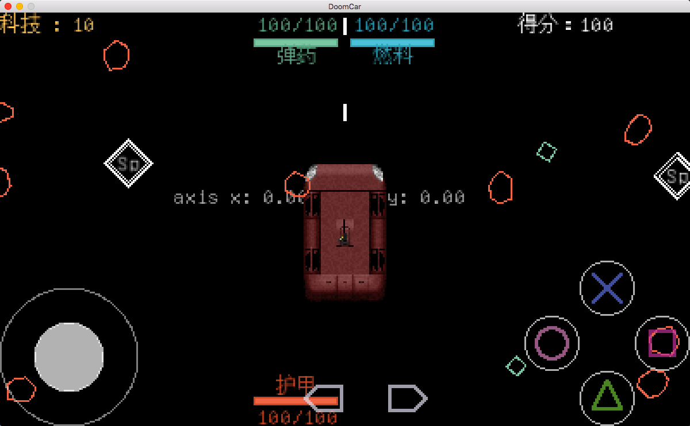

# Doom Car 毁灭战车

Study BYTEPATH SSYGEN blog。Make a Doom Car game.
学习SSYGEN大神的blog，改装制作一个战车射击游戏。
相对于飞船，更喜欢战车。改装为《重装机兵》风格的战车游戏。

## 战车部件
1. 底盘 影响战车基本形状，如吉普车、装甲车、坦克等
2. 引擎 影响战车速度，牵引力
3. 主炮 包括炮的类别和弹仓。威力大，数量有限。
4. 副炮 机枪、火焰喷射器等。威力小，弹药无限。
5. 特殊 特殊攻击或效果。如护盾、电磁风暴、导弹等。
6. 装甲 装甲度为0，战车被击毁。

##  城镇
1. 酒馆 探索信息，获得知识，解锁地图。
2. 猎人俱乐部 升级技能，获得任务，领取悬赏
3. 车库 修理战车、改装、购买部件、补充弹药
4. 其他 未定

##  敌人
1. 改造机器人 各类生物被改装的机器人
2. 僵尸 基因改造的各种不死生物
3. 机器人 纯机器人。
4. 人类海盗 拥有战车，抢劫商队的集团
5. 阵营 敌对阵营。往往拥有正规的武器

## 地图
1. 世界地图 被破坏的面目全非的地球
2. 城镇地图 各种风格迥异的建筑组成，且构成不同的阵营
3. 战斗地图 依据目前所处位置，生成随机地图。沙漠、草原、陆地、城市、森林等

## 请求支援

love2d 是一个小众的游戏框架。 相关文档较少。
很多插件支持都是爱好者自发设计，想加admob模块。
love2d论坛，有大神做了 love2d 0.10.2版。love2d新版11并没有做。
同时自己在 love2d打包 ipa 和 apk 方面，还有些问题。
现发布了一个 猪八戒需求。 求欢迎大神们指导。

https://task.zbj.com/14419272

## 战斗模式
1. 挑战 互相射击，消灭一定的护甲片，获胜
2. 赶路 特定时间通过一张地图
3. 讨伐 消灭一定数量的怪物
4. 悬赏 消灭特殊boss
5. 寻找 消灭怪物，寻找物品

考虑 dota游戏模式。 多个战车互相对战。
需要联机模式。或者考虑，极简战斗，分屏幕。
-------------------------------------------
特点1. 技能树
特点2. 丰富的射击

---------------------
## 目前进度
### 11 被动效果 正在进行
### 12 更多被动 关键点
### 13 技能树基本已经完成。camera bug .= = 被卡主了。
### 14 修改为自己的风格。 CDDA 与 重装机兵 风格
---------------------
## 截图

